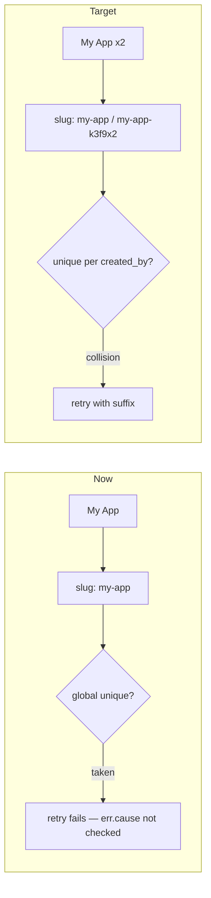

# Per-User Slug + Retry Fix

Decisions from grill (locked):

- Duplicate **names** allowed; slug disambiguates in the list (name + slug — already in [`app/(admin)/projects/page.tsx`](<app/(admin)/projects/page.tsx>))
- Slug unique **per user** (`created_by + slug`), not globally
- Same-user collision: **silent suffix** (`my-app` → `my-app-k3f9x2`)
- Ship schema migration + retry fix in one change

## Current vs target



## 1. Schema — [`lib/db/flag-schema.ts`](lib/db/flag-schema.ts)

In `projects` table:

- Remove `.unique()` from the `slug` column (line 32 today: `slug: text("slug").notNull().unique()`)
- Add composite unique in the table callback (alongside existing `projects_created_by_idx`):

```ts
unique("projects_created_by_slug_unique").on(table.createdBy, table.slug),
```

No data backfill — global unique was stricter; existing rows remain valid.

## 2. Migration

Run `bunx drizzle-kit generate` → expect migration that:

- `DROP CONSTRAINT "projects_slug_unique"`
- `ADD CONSTRAINT "projects_created_by_slug_unique" UNIQUE("created_by", "slug")`

Apply locally with `bunx drizzle-kit migrate` (or your usual workflow).

## 3. Retry fix — [`app/actions/projects.ts`](app/actions/projects.ts)

Replace top-level-only `isUniqueViolation` (lines 32–38) with a helper that walks the error chain (`err`, `err.cause`, nested causes) looking for Postgres `code === "23505"`.

Drizzle/neon-serverless often wraps the real `DatabaseError` on `cause`, which is why second "My App" fails today despite retry logic existing.

No change to retry loop itself — still: attempt 0 = clean slug, attempts 1–4 = `slugWithSuffix(baseSlug)`, max 5 tries.

## 4. Out of scope (no changes)

- UI / create dialog — silent suffix, no new toast
- [`lib/slug.ts`](lib/slug.ts) — helpers unchanged

## Verify

- `bunx tsc --noEmit` + `bun run lint`
- Manual: create "My App" twice as same user → both succeed, list shows same name + different slugs
- Different users can both own slug `my-app` (after migration)
